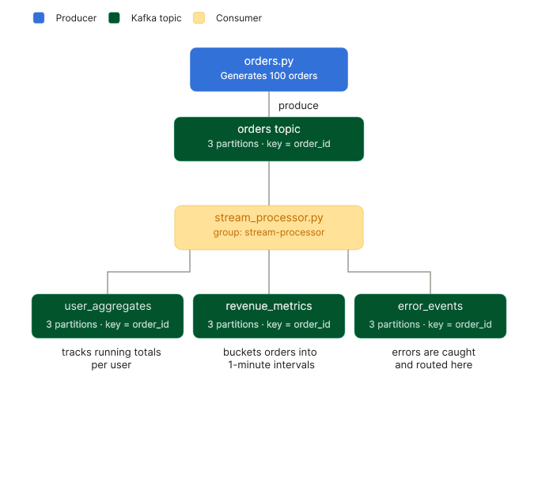

# Real-Time Analytics & Schema Evolution Pipeline
**Kafka Intern Project 2**

## 📌 Project Overview
This project extends the e-commerce platform from Project 1 by adding **schema enforcement**, **schema evolution**, and **real-time stream processing**. It introduces Confluent Schema Registry with Avro serialization, and a stream processor that computes per-user revenue aggregates and per-minute revenue metrics in real time.

---

## 🏗 Infrastructure

### Full Stack (docker-compose)
The infrastructure adds two new services on top of the 2-node KRaft cluster from Project 1:

| Service | Role |
|---|---|
| `kafka1`, `kafka2` | 2-node KRaft Kafka cluster |
| `schema-registry` | Confluent Schema Registry on port `8081` |
| `kafka-init` | One-shot container that creates all topics on startup |

### Automatic Topic Creation via `kafka-init`
Rather than manually running `kafka-topics --create` after the cluster starts, a dedicated init container handles topic creation automatically on every `docker-compose up`.

```bash
# kafka-init waits for both brokers to be ready, then creates all topics
cub kafka-ready -b kafka1:9093 2 60
kafka-topics --bootstrap-server kafka1:9093 --create --if-not-exists --topic orders ...
```

**Why a dedicated container?** The `KAFKA_CREATE_TOPICS` environment variable has a race condition in multi-broker setups — it fires before brokers are fully ready. Using `cub kafka-ready` guarantees topics are only created once the cluster is healthy.

### Topics

| Topic | Partitions | Replication | Purpose |
|---|---|---|---|
| `orders` | 3 | 2 | Raw order events (input) |
| `user_aggregates` | 3 | 2 | Per-user running revenue totals |
| `revenue_metrics` | 3 | 2 | Revenue bucketed by minute |
| `error_events` | 3 | 2 | Invalid/corrupt messages |

---

## Schema Registry & Avro

### Why Schema Registry?
In Project 1, producers sent raw JSON — no enforcement, no contract. Any field could be missing or mistyped and consumers would only discover this at runtime. Schema Registry solves this by acting as a **central contract office**: schemas are registered once, and every message is validated against the schema before it's sent.

### Schema Evolution

Two schema versions are defined in the `schemas/` folder.

**Version 1** (`order_schema_v1.avsc`) — the original order shape:
```json
{
  "type": "record",
  "name": "Order",
  "namespace": "com.ecommerce",
  "fields": [
    {"name": "order_id",  "type": "string"},
    {"name": "user",      "type": "string"},
    {"name": "item",      "type": "string"},
    {"name": "category",  "type": "string"},
    {"name": "price",     "type": "int"},
    {"name": "quantity",  "type": "int"},
    {"name": "timestamp", "type": "double"}
  ]
}
```

**Version 2** (`order_schema_v2.avsc`) — adds a `currency` field:
```json
{"name": "currency", "type": ["null", "string"], "default": null}
```

### Backward Compatibility
The `currency` field uses a **union type** `["null", "string"]` with `"default": null`. This ensures:
- Old consumers that don't know about `currency` can still read new messages — they simply ignore the field
- The schema registry accepts this evolution without breaking existing consumers

---

## Data Pipeline



### Producer (`orders.py`)
Generates 100 order events, one every 5 seconds. Each order is serialized using `AvroSerializer` against `order_schema_v2.avsc` and registered with Schema Registry on first run.

### Stream Processor (`stream_processor.py`)
The core of Project 2. Consumes from `orders`, maintains in-memory state, and produces to three output topics.

**Per-user aggregates** — tracks running totals per user across all messages seen so far:
```python
user_aggregates[user]["order_count"] += 1
user_aggregates[user]["total_revenue"] += revenue
```

**Revenue per minute** — buckets each order's timestamp into a 1-minute window:
```python
bucket = int(timestamp // 60) * 60   # floors to nearest minute
revenue_by_minute[bucket] += revenue
```

**Error handling** — three failure modes are caught and routed to `error_events`:
- Kafka consumer errors
- Avro deserialization failures (schema mismatch, corrupt message)
- Invalid business logic (quantity ≤ 0)

**Manual offset commits** — `enable.auto.commit: False` means offsets are only committed *after* successful processing and produce. If the script crashes mid-processing, the message will be reprocessed on restart — no data loss.

---

## 💻 How to Run

### 1. Install Dependencies
```bash
pip install confluent-kafka fastavro httpx attrs
```

### 2. Start Infrastructure
```bash
docker-compose up -d
```
Topics are created automatically by `kafka-init`. Verify Schema Registry is up:
```bash
curl http://localhost:8081/subjects
```

### 3. Install key packages
```bash
    pip install confluent-kafka fastavro httpx attrs
```


### 4. Run Services (separate terminals)
```bash
python src/stream_processor.py
```

### 5. Run Producer
```bash
python src/orders.py
```

### 6. Monitor Output Topics
```bash
# Check user aggregates
docker exec -it kafka1 kafka-console-consumer \
  --bootstrap-server kafka1:9093 \
  --topic user_aggregates --from-beginning

# Check revenue metrics
docker exec -it kafka1 kafka-console-consumer \
  --bootstrap-server kafka1:9093 \
  --topic revenue_metrics --from-beginning

# Check error events
docker exec -it kafka1 kafka-console-consumer \
  --bootstrap-server kafka1:9093 \
  --topic error_events --from-beginning
```

---

## 📝 Key Learnings

- **Schema Registry as a contract:** Enforcing a schema at the producer level means bad data never enters the pipeline — errors surface immediately rather than silently corrupting downstream consumers.
- **Schema evolution with backward compatibility:** Adding nullable fields with defaults allows schemas to evolve without breaking existing consumers — old code keeps working, new code gains new fields.
- **Manual offset commits:** Auto-commit acknowledges receipt, not completion. Manual commits after processing guarantees at-least-once delivery — messages are never silently lost on a crash.
- **Time-windowed aggregations:** Flooring a timestamp to the nearest minute (`timestamp // 60 * 60`) is the simplest form of tumbling window aggregation — the same concept used in full stream processing frameworks like Flink and Kafka Streams.
- **In-memory state trade-offs:** Storing aggregates in Python dicts is fast and simple, but restarting the processor resets all state. Production systems would use a persistent state store (like RocksDB via Kafka Streams) to survive restarts.
